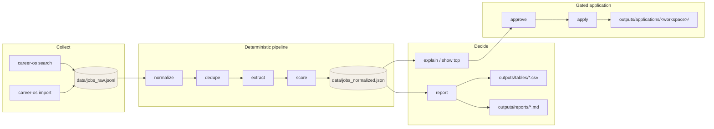
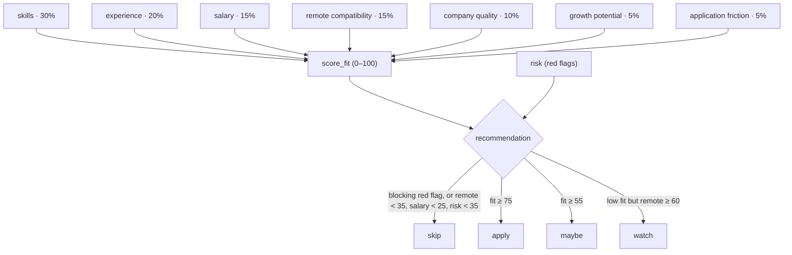
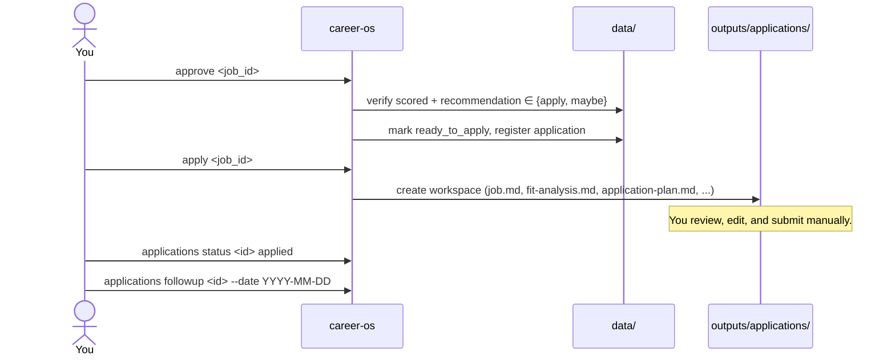
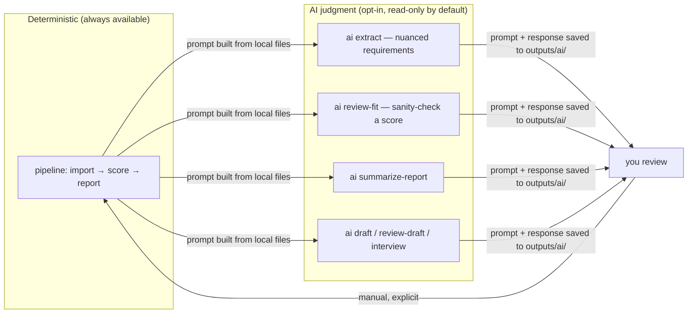

# CareerOS

[](https://github.com/DerMayer1/CareerOS/actions/workflows/ci.yml)
[](package.json)
[](package.json)
[](LICENSE)

**CareerOS is a local-first CLI radar for remote job opportunities.** It inverts the usual job-hunt tooling: instead of helping you apply to more jobs faster, it helps you **decide which jobs deserve an application at all**. Jobs flow through a deterministic pipeline — collect, normalize, dedupe, extract, score, report — and application material can only be generated for jobs that pass an explicit approval gate.

```text
$ career-os status
{
  "raw_jobs": 2,
  "normalized_jobs": 2,
  "scored_jobs": 2,
  "recommendations": {
    "apply": 1,
    "skip": 1
  },
  "applications": 1,
  "latest_report": "outputs/reports/2026-07-07-remote-radar.md"
}
```

## Design Principles

1. **Decisions before applications.** The center of the product is a ranked decision table, not a submission bot. CareerOS never submits applications or contacts employers.
2. **Deterministic core, AI at the edges.** Import, parsing, dedupe, normalization, scoring, and reporting are plain code — reproducible, testable, token-free. AI (via an optional [Codex CLI](#ai-layer-optional) layer) is used only where language judgment is genuinely needed: requirement extraction, fit review, drafting, interview prep.
3. **Local files are the source of truth.** All state lives in open formats — JSONL, JSON, CSV, Markdown — in `data/` and `outputs/`. No server, no database, no account. Every file is inspectable, diffable, and versionable.
4. **Auditable scoring.** Every score decomposes into weighted component scores with a human-readable `score_explanation`. `career-os explain <job_id>` shows exactly why a job was recommended or skipped.
5. **Honest data.** Unknown fields stay `unknown`. The pipeline never fills gaps with guesses, and AI output is saved as reviewable artifacts — it never silently mutates scored jobs.

## How It Works



Each stage reads and writes plain files, so the pipeline is resumable and every intermediate state can be inspected:

| Stage | Command | Input | Output |
|---|---|---|---|
| Collect | `search` / `import` | APIs, RSS, JSON/JSONL/CSV files | `data/jobs_raw.jsonl` (append-only) |
| Normalize | `normalize` | raw jobs | `data/jobs_normalized.json` (CareerOS job model) |
| Dedupe | `dedupe` | normalized jobs | merged records + `data/seen_jobs.json` |
| Extract | `extract` | normalized jobs | deterministic requirements, salary normalization, red flags |
| Score | `score` | extracted jobs + profile + weights | component scores, `score_fit`, recommendation |
| Report | `report` | scored jobs (no fetching, no AI) | 10 CSV decision tables + Markdown report |
| Apply | `approve` → `apply` | one approved job | gated workspace under `outputs/applications/` |

## Quick Start

```bash
npm install
npm link            # optional; enables the `career-os` command

career-os init          # create folders, configs, profile templates, data files
career-os profile setup # interactive profile wizard (--yes for scripted use)
career-os doctor        # verify the installation end to end
```

`doctor` checks the runtime, workspace permissions, schema validity, local data, profile completeness, and the optional Codex integration:

```text
$ career-os doctor
{
  "healthy": true,
  "warnings": 1,
  "checks": [
    { "name": "node",          "level": "critical", "ok": true,  "detail": "Node 22.22.0; required >=18" },
    { "name": "workspace",     "level": "critical", "ok": true,  "detail": "..." },
    { "name": "configuration", "level": "critical", "ok": true,  "detail": "configuration and profile schemas are valid" },
    { "name": "data",          "level": "critical", "ok": true,  "detail": "local data files are readable" },
    { "name": "profile",       "level": "warning",  "ok": false, "detail": "1 profile files need attention" },
    { "name": "codex",         "level": "info",     "ok": true,  "detail": "AI is disabled; deterministic pipeline is available" }
  ]
}
```

Then run the pipeline against the bundled sample data:

```bash
career-os import examples/jobs.sample.json
career-os normalize
career-os dedupe
career-os extract
career-os score
career-os report
career-os show top
```

## Collecting Jobs

CareerOS ships with public remote-job sources, listed via `sources list`:

```text
$ career-os sources list
source,enabled,type,phase,url
remotive,true,public_api,2,https://remotive.com/api/remote-jobs
jobicy,true,public_api,2,https://jobicy.com/api/v2/remote-jobs
remoteok,true,public_api,2,https://remoteok.com/api
wwr,true,rss,2,https://weworkremotely.com/remote-jobs.rss
wellfound,true,manual_search,2,https://wellfound.com/jobs
indeed_br,true,manual_search,2,https://br.indeed.com
glassdoor_br,true,manual_search,2,https://www.glassdoor.com.br
linkedin,false,low_volume_reference,2,
```

```bash
career-os search remotive --query "AI Engineer" --limit 10
career-os search all --query "AI Engineer" --limit 20   # all automatic providers, concurrently
career-os search wellfound --query "AI Engineer"        # manual source: prints a search URL
```

Design decisions worth knowing:

- **`search all` degrades gracefully.** Providers run concurrently; a failed provider is reported without discarding successful ones, and stale cache (bounded by `cache_max_entries` in `config/sources.json`) is used when available.
- **Manual sources never fake data.** Wellfound, Indeed Brazil, and Glassdoor Brazil have no low-risk public API, so they print search URLs instead of writing fabricated job rows.
- **Requests are hardened.** Timeouts, bounded retries, redirect limits, and response-size limits on every provider request.
- **Imports are forgiving but strict.** JSONL imports keep valid rows and quarantine rejected lines under `outputs/import-errors/`. CSV handles quoted commas, escaped quotes, CRLF, and multiline descriptions. Use `--dry-run` to inspect without writing.

## Scoring

`career-os score` computes eight component scores per job, combines seven of them into a weighted `score_fit` (0–100), and derives a recommendation. Weights live in `config/scoring_weights.json`:



Risk is scored separately from fit — a single `blocking` red flag forces `skip` regardless of how good the fit is, and `warning`/`info` flags subtract from the risk score. Red flag rules live in [skills/job-radar/red-flags.md](skills/job-radar/red-flags.md).

Every score is explainable after the fact:

```text
$ career-os explain manual:94cf20d12310ce92
# Example AI - Senior Full Stack Engineer, AI Tools

- Recommendation: apply
- Score: 85

## Component Scores

- Skills: 90            - Company: 50
- Experience: 90        - Growth: 75
- Salary: 95            - Application friction: 75
- Remote: 90            - Risk: 100

## Explanation

- skills: 4/5 required skills matched; 1 partial; missing: none.
- salary: Minimum normalized salary 7000 USD/month meets target 7000.
- remote: Remote region LATAM is accepted.
- company: Company metadata is mostly unknown.
- risk: 0 blocking, 0 warning, 0 info red flags.

## Requirements

- Matched: python; typescript; react; llm
- Partial: apis
- Missing: none
```

Note the `company: 50` — company metadata was unknown, so it scored neutrally rather than being guessed. That is the honest-data principle in action.

## Decision Reports

`career-os report` renders existing scored data only — it never fetches, rescores, or spends AI tokens. It writes a Markdown report to `outputs/reports/` and ten CSV decision tables to `outputs/tables/`:

| Table | Question it answers |
|---|---|
| `top_matches` | fit ≥ 75 and recommended `apply` — where to focus |
| `easy_wins` | strong skill match and low application friction |
| `high_salary_medium_fit` | ≥ $4k/month but fit 55–74 — worth a closer look |
| `stretch_roles` | recommended `maybe` |
| `skill_gap_heatmap` | which missing skills block the most jobs |
| `red_flags` | which jobs carry which risks |
| `salary_transparency` | who publishes compensation |
| `remote_fit` | region and timezone compatibility |
| `best_next_actions` | prioritized to-do list |
| `skip` | rejected jobs, with reasons |

```text
$ career-os report && head outputs/reports/2026-07-07-remote-radar.md
# Remote Radar - 2026-07-07

## Summary

- Jobs normalized: 2
- Jobs scored: 2
- Top matches: 1
- Easy wins: 1
- Skips: 1

## Best Opportunity

**Example AI - Senior Full Stack Engineer, AI Tools** is currently the strongest visible opportunity.

- Score: 85 · Recommendation: apply
- Salary: 7000-10000 USD/month · Remote: LATAM (good timezone overlap)
```

Print any table directly with `career-os show top`, `show gaps`, `show red-flags`, or `show <table> [limit]`.

## The Application Gate

Application material can only be generated for jobs that clear three checks — normalized, scored, and recommended `apply` or `maybe` — and are then **explicitly approved**:



Attempting `apply` without approval fails: `Application generation is gated. Run career-os approve <job_id> first.` The workspace contains `job.md`, `fit-analysis.md`, `application-plan.md`, `cv-notes.md`, `application-message.md`, `cover-letter.md`, and `interview-prep.md` — see a complete example under [outputs/applications/](outputs/applications/example-ai-senior-full-stack-engineer-ai-tools-2026-07-07/).

Applications are then tracked in `data/applications.csv` with status transitions and manual follow-up dates:

```text
$ career-os applications list
application_id,job_id,company,role_title,status,recommendation,score_fit,...,next_follow_up
app:ea5f68779d5fd971,manual:94cf20d12310ce92,Example AI,"Senior Full Stack Engineer, AI Tools",interviewing,apply,85,...,2026-07-14
```

## AI Layer (Optional)

CareerOS uses [Codex CLI](docs/codex-cli-integration.md) as an opt-in judgment layer on top of the deterministic pipeline. Nothing in the core requires it — `doctor` reports `"AI is disabled; deterministic pipeline is available"` by default.



The contract with the AI layer:

- **Every prompt and response is a local artifact** under `outputs/ai/`, timestamped and reviewable. Application AI commands additionally copy the response into the approved workspace (e.g. `ai-draft.md`).
- **AI never mutates state.** It proposes; you apply. The sandbox defaults to `read-only` (`workspace-write` additionally requires `allow_workspace_write: true`).
- **Token economy is a product requirement.** Prompts and outputs are size-capped (`max_prompt_chars`, `max_output_chars`), and reports never trigger AI calls.

Configuration lives in `config/ai.json` (schema-validated, like all configs):

```json
{
  "provider": "codex-cli",
  "enabled": false,
  "command": "codex",
  "sandbox": "read-only",
  "approval": "never",
  "output_dir": "outputs/ai",
  "timeout_ms": 300000,
  "max_prompt_chars": 120000,
  "max_output_chars": 120000
}
```

```bash
career-os ai doctor                 # verify Codex availability and config
career-os ai profile-sync --dry-run # propose profile edits
career-os ai extract new --limit 5  # nuanced requirement extraction
career-os ai review-fit <job_id>    # second opinion on a deterministic score
career-os ai draft <application_id> # draft material for an approved application
```

## Architecture

```text
bin/career-os.js          entry point (thin wrapper)
src/
├── cli.js                command implementations
├── cli/                  dispatch table + help
├── core/                 csv, dedupe, flags, paths, validation
├── scoring/engine.js     component scores, weights, recommendation thresholds
├── sources/providers.js  source provider interface (API / RSS / manual)
├── ai/                   codex-cli provider (prompt build, spawn, artifact capture)
├── applications/         application record schema
└── storage/              atomic file writes + file store
config/                   schema-validated JSON configs (sources, weights, ai, profile)
schemas/                  JSON Schemas for every config and data file
profile/                  your candidate profile and role preferences (Markdown)
skills/                   scoring rules, search rules, red-flag definitions
data/                     pipeline state (jsonl / json / csv)
outputs/                  reports, tables, AI artifacts, application workspaces
docs/                     design docs per subsystem and phase
```

- **Zero runtime dependencies.** Plain Node ≥ 18, CommonJS, standard library only. `npm install` installs nothing at runtime.
- **Schema-validated boundaries.** Every config and data file has a JSON Schema in `schemas/`; `doctor` validates them.
- **Atomic writes.** State files are written via temp-file-and-rename (`src/storage/atomic-file.js`) so an interrupted run can't corrupt data.
- **Fail fast, fail clear.** Unknown, duplicate, or invalid flags exit with code 2. Errors are concise by default; `--verbose` adds a stack trace, `--json-errors` emits structured errors for scripting.
- **Agent-ready.** [AGENTS.md](AGENTS.md) defines operating rules for driving CareerOS with a coding agent — the CLI is the operational surface, and the same gates apply.

## Command Reference

<details>
<summary><strong>Setup & diagnostics</strong></summary>

| Command | Purpose |
|---|---|
| `career-os init` | Create local folders, configs, profile templates, and data files |
| `career-os doctor [--network] [--strict]` | Check runtime, permissions, schemas, data, profile, Codex, DNS |
| `career-os profile setup` | Interactive profile wizard; `--yes` with flags for scripts |
| `career-os profile check` | Report missing/TODO profile fields |
| `career-os status` | Print current local state |
| `career-os reset --data` | Clear local generated data |

</details>

<details>
<summary><strong>Pipeline</strong></summary>

| Command | Purpose |
|---|---|
| `career-os sources list` | List configured remote sources |
| `career-os search <source\|all>` | Search remote sources and append raw jobs |
| `career-os import <file>` | Import JSON, JSONL, or multiline CSV; invalid JSONL rows quarantined |
| `career-os normalize` | Convert raw jobs into the CareerOS job model |
| `career-os dedupe` | Deduplicate normalized jobs and update seen state |
| `career-os extract` | Extract deterministic requirements and job signals |
| `career-os score` | Apply deterministic multidimensional scoring |
| `career-os report` | Export CSV tables and Markdown report |

</details>

<details>
<summary><strong>Decisions</strong></summary>

| Command | Purpose |
|---|---|
| `career-os show top [limit]` | Print top apply/maybe roles |
| `career-os show gaps [limit]` | Print skill gap heatmap |
| `career-os show red-flags [limit]` | Print red flags table |
| `career-os show <table> [limit]` | Print any exported table |
| `career-os explain <job_id>` | Explain one scored job, component by component |

</details>

<details>
<summary><strong>Applications</strong></summary>

| Command | Purpose |
|---|---|
| `career-os approve <job_id>` | Mark a scored job as ready to apply |
| `career-os apply <job_id>` | Create a gated manual application workspace |
| `career-os applications list [limit]` | List tracked applications |
| `career-os applications status <id> <status>` | Manually update application status |
| `career-os applications followup <id> --date YYYY-MM-DD` | Set next manual follow-up date |
| `career-os application plan\|cv-notes\|draft <id>` | Regenerate application material |
| `career-os interview <id>` | Generate interview prep brief |

</details>

<details>
<summary><strong>AI (optional)</strong></summary>

| Command | Purpose |
|---|---|
| `career-os ai doctor` | Verify Codex CLI availability and AI configuration |
| `career-os ai profile-sync` | Review profile files and propose edits |
| `career-os ai extract <job_id\|new>` | Extract nuanced requirements from descriptions |
| `career-os ai review-fit <job_id>` | Review one deterministic score and recommendation |
| `career-os ai summarize-report` | Summarize the latest decision report |
| `career-os ai draft <id>` | Draft approved application material |
| `career-os ai review-draft <id>` | Review approved application drafts |
| `career-os ai interview <id>` | Create deeper interview prep |

</details>

## Development

```bash
npm ci
npm run ci   # syntax check + unit & integration tests + package manifest check
```

Tests use the built-in `node --test` runner — unit tests for csv/dedupe/flags/validation/atomic-file/providers plus integration tests that exercise the full pipeline and error paths. GitHub Actions runs the suite on Node 18, 20, and 22 across Linux, Windows, and macOS.

Design docs for each subsystem live under [docs/](docs/) — the [AI layer](docs/ai-layer.md), [provider interface](docs/provider-interface.md), [database layer](docs/database-layer.md), and per-phase design notes.

## Product Boundary

CareerOS intentionally does **not**:

- submit applications or contact employers,
- bulk-generate application material,
- invent candidate experience, credentials, compensation, or company facts,
- fill unknown data with guesses.

It ranks, explains, gates, and drafts — the final click is always yours.

## License

[MIT](LICENSE)
